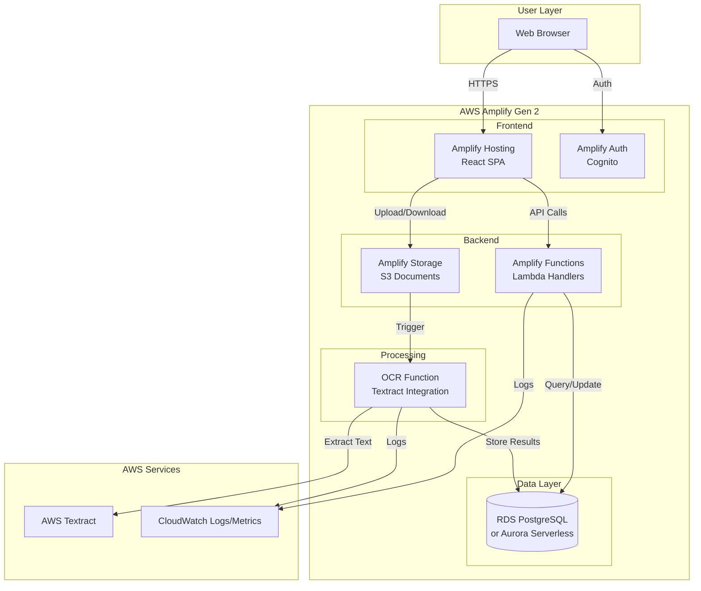

# Design Document: AWS Amplify Gen 2 Migration

## Overview

This design document outlines the architecture and implementation strategy for migrating the CTCM freight forwarding application from a custom CDK-based infrastructure to AWS Amplify Gen 2. The migration consolidates eight separate CDK stacks into a unified Amplify backend configuration, simplifying deployment and reducing operational complexity while maintaining all existing functionality.

### Current Architecture

The existing system uses AWS CDK with the following stacks:
- **NetworkStack**: VPC, security groups, subnets
- **AuthStack**: Cognito User Pool with admin/customer groups
- **DataStack**: RDS PostgreSQL (t4g.micro), S3 document bucket
- **ApiStack**: API Gateway REST API with Lambda functions for shipments, customers, invoices, documents, search
- **AmplifyFrontendStack**: Amplify Hosting (partial implementation)
- **OcrStack**: Placeholder for Textract OCR pipeline
- **ObservabilityStack**: CloudWatch dashboards and alarms
- **FrontendStack**: S3 + CloudFront (legacy, being replaced)

### Target Architecture

Amplify Gen 2 provides an integrated platform that replaces most CDK stacks:
- **Amplify Hosting**: Replaces S3 + CloudFront for frontend
- **Amplify Auth**: Declarative Cognito configuration
- **Amplify Data**: GraphQL API with AppSync or REST API with functions
- **Amplify Storage**: Declarative S3 configuration with access controls
- **Amplify Functions**: Lambda functions with simplified deployment
- **Database**: Keep RDS PostgreSQL or migrate to Aurora Serverless v2/DynamoDB

### Migration Benefits

1. **Simplified Deployment**: Single `amplify` directory replaces `infra/` with 8 stacks
2. **Cost Reduction**: Amplify free tier + optimized resource usage targets $15/month budget
3. **TypeScript-First**: All configuration in TypeScript (no CloudFormation templates)
4. **Integrated CI/CD**: Built-in deployment pipeline via Amplify Console
5. **Developer Experience**: Local sandbox environments, hot-reload, unified CLI
6. **Reduced Maintenance**: Managed services reduce operational overhead

## Architecture


### High-Level Architecture Diagram



### Component Architecture


#### 1. Amplify Project Structure

```
CTCMweb/
├── amplify/
│   ├── auth/
│   │   └── resource.ts          # Cognito configuration
│   ├── data/
│   │   └── resource.ts          # Database connection or AppSync schema
│   ├── storage/
│   │   └── resource.ts          # S3 bucket configuration
│   ├── functions/
│   │   ├── shipments/
│   │   │   ├── handler.ts       # Shipment CRUD operations
│   │   │   └── resource.ts      # Function configuration
│   │   ├── customers/
│   │   │   ├── handler.ts       # Customer CRUD operations
│   │   │   └── resource.ts
│   │   ├── invoices/
│   │   │   ├── handler.ts       # Invoice CRUD operations
│   │   │   └── resource.ts
│   │   ├── documents/
│   │   │   ├── handler.ts       # Document upload/retrieval
│   │   │   └── resource.ts
│   │   ├── search/
│   │   │   ├── handler.ts       # Search across entities
│   │   │   └── resource.ts
│   │   └── ocr/
│   │       ├── handler.ts       # OCR processing
│   │       └── resource.ts
│   ├── backend.ts               # Main backend definition
│   └── package.json             # Amplify dependencies
├── apps/
│   ├── web/                     # React frontend (unchanged)
│   └── api/                     # Existing handlers (to be migrated)
├── packages/
│   ├── types/                   # Shared TypeScript types
│   └── utils/                   # Shared utilities
└── package.json                 # Root package.json
```

#### 2. Authentication Architecture

Amplify Auth will replace the manual Cognito setup with declarative configuration:

```typescript
// amplify/auth/resource.ts
import { defineAuth } from '@aws-amplify/backend'

export const auth = defineAuth({
  loginWith: {
    email: true,
  },
  userAttributes: {
    email: {
      required: true,
      mutable: true,
    },
    fullname: {
      required: false,
      mutable: true,
    },
  },
  groups: ['admin', 'customer'],
  multifactor: {
    mode: 'OPTIONAL',
    totp: true,
  },
})
```

**Migration Strategy for Existing Users:**
- Option 1: Keep existing User Pool, configure Amplify to use it
- Option 2: Create new User Pool, migrate users via Cognito User Migration trigger
- Recommendation: Option 1 for minimal disruption


#### 3. API Layer Architecture

**Decision Point: REST vs GraphQL**

Two approaches for the API layer:

**Option A: Amplify Functions with REST API (Recommended)**
- Migrate existing Lambda handlers to Amplify Functions
- Maintain REST API endpoints
- Minimal code changes to existing handlers
- Direct database connection via connection pooling

**Option B: AppSync GraphQL API**
- Complete rewrite of API layer
- GraphQL schema replaces REST endpoints
- Resolvers replace Lambda handlers
- Better for real-time subscriptions
- Higher migration effort

**Recommendation: Option A** - Maintains existing API contracts, reduces migration risk, and preserves existing handler logic.

#### 4. Database Strategy

**Three Options Evaluated:**

**Option 1: Keep RDS PostgreSQL t4g.micro (Current)**
- Cost: ~$15/month
- Pros: No migration, existing queries work, PostgreSQL features
- Cons: Always-on cost, no auto-scaling
- Recommendation: Best for initial migration

**Option 2: Aurora Serverless v2**
- Cost: ~$20-40/month (0.5 ACU minimum)
- Pros: Auto-scaling, PostgreSQL compatible
- Cons: Over budget, minimum capacity cost
- Recommendation: Consider for production

**Option 3: DynamoDB**
- Cost: ~$5-10/month (on-demand)
- Pros: Serverless, pay-per-use, scales automatically
- Cons: Complete data model redesign, query pattern changes, no joins
- Recommendation: Future optimization, not initial migration

**Selected Strategy: Option 1** - Keep RDS PostgreSQL for initial migration, evaluate DynamoDB after successful cutover.


#### 5. Storage Architecture

Amplify Storage provides declarative S3 configuration with built-in access controls:

```typescript
// amplify/storage/resource.ts
import { defineStorage } from '@aws-amplify/backend'

export const storage = defineStorage({
  name: 'ctcmDocuments',
  access: (allow) => ({
    'invoices/{entity_id}/*': [
      allow.authenticated.to(['read', 'write']),
      allow.groups(['admin']).to(['read', 'write', 'delete']),
    ],
    'receipts/{entity_id}/*': [
      allow.authenticated.to(['read', 'write']),
      allow.groups(['admin']).to(['read', 'write', 'delete']),
    ],
    'documents/{entity_id}/*': [
      allow.authenticated.to(['read', 'write']),
      allow.groups(['admin']).to(['read', 'write', 'delete']),
    ],
  }),
})
```

**Migration Strategy:**
- Create new Amplify Storage bucket
- Copy existing documents from `ctcm-dev-documents-404875533723` to new bucket
- Update application code to use Amplify Storage SDK
- Maintain existing bucket temporarily for rollback

#### 6. OCR Pipeline Architecture

The OCR pipeline processes uploaded warehouse receipts using AWS Textract:

```typescript
// amplify/functions/ocr/handler.ts
import { Textract } from '@aws-sdk/client-textract'
import { S3Event } from 'aws-lambda'

export const handler = async (event: S3Event) => {
  // 1. Receive S3 upload event
  // 2. Start Textract async job
  // 3. Poll for completion or use SNS notification
  // 4. Parse extracted text
  // 5. Store structured data in database
  // 6. Update document status
}
```

**Trigger Configuration:**
- S3 event notification on `receipts/` prefix
- Lambda function invoked on object creation
- Async processing with status updates


## Components and Interfaces

### 1. Backend Definition

The main backend configuration ties all resources together:

```typescript
// amplify/backend.ts
import { defineBackend } from '@aws-amplify/backend'
import { auth } from './auth/resource'
import { storage } from './storage/resource'
import { shipmentsFunction } from './functions/shipments/resource'
import { customersFunction } from './functions/customers/resource'
import { invoicesFunction } from './functions/invoices/resource'
import { documentsFunction } from './functions/documents/resource'
import { searchFunction } from './functions/search/resource'
import { ocrFunction } from './functions/ocr/resource'

const backend = defineBackend({
  auth,
  storage,
  shipmentsFunction,
  customersFunction,
  invoicesFunction,
  documentsFunction,
  searchFunction,
  ocrFunction,
})

// Configure database connection for all functions
const databaseConfig = {
  host: process.env.DATABASE_HOST,
  port: 5432,
  database: 'ctcm',
  secretArn: process.env.DATABASE_SECRET_ARN,
}

// Add database environment variables to all functions
for (const func of [
  backend.shipmentsFunction,
  backend.customersFunction,
  backend.invoicesFunction,
  backend.documentsFunction,
  backend.searchFunction,
  backend.ocrFunction,
]) {
  func.addEnvironment('DATABASE_HOST', databaseConfig.host)
  func.addEnvironment('DATABASE_SECRET_ARN', databaseConfig.secretArn)
}

// Configure S3 trigger for OCR function
backend.storage.bucket.addEventNotification(
  s3.EventType.OBJECT_CREATED,
  new s3n.LambdaDestination(backend.ocrFunction.resource),
  { prefix: 'receipts/' }
)
```

### 2. Function Interface Pattern

All Amplify Functions follow a consistent pattern:

```typescript
// amplify/functions/[entity]/resource.ts
import { defineFunction } from '@aws-amplify/backend'

export const [entity]Function = defineFunction({
  name: 'ctcm-[entity]',
  entry: './handler.ts',
  runtime: 18,
  timeoutSeconds: 30,
  memoryMB: 512,
})
```

```typescript
// amplify/functions/[entity]/handler.ts
import { APIGatewayProxyHandler } from 'aws-lambda'
import { [Entity]Service } from '../../../apps/api/src/services/[entity]-service'

export const handler: APIGatewayProxyHandler = async (event) => {
  // Route to existing service layer
  // Maintain existing business logic
  // Return consistent response format
}
```


### 3. Frontend Integration

The React frontend will use Amplify client libraries:

```typescript
// apps/web/src/lib/amplify-config.ts
import { Amplify } from 'aws-amplify'
import outputs from '../../../amplify_outputs.json'

Amplify.configure(outputs)

export { Amplify }
```

**Changes Required:**
- Replace custom Cognito integration with Amplify Auth SDK
- Replace axios API calls with Amplify API SDK (or keep axios with Amplify auth headers)
- Replace custom S3 upload with Amplify Storage SDK
- Update environment variable references

**Minimal Code Changes:**
- Auth: Replace `CognitoIdentityServiceProvider` with `Auth` from `aws-amplify/auth`
- API: Add Amplify auth headers to existing axios calls
- Storage: Replace `S3Client` with `uploadData` from `aws-amplify/storage`

### 4. Database Connection Management

Amplify Functions will use the existing database connection pattern:

```typescript
// Shared database client (reuse from apps/api/src/lib/db.ts)
import { SecretsManager } from '@aws-sdk/client-secrets-manager'
import { Pool } from 'pg'

let pool: Pool | null = null

export async function getDbPool(): Promise<Pool> {
  if (pool) return pool
  
  const secretsManager = new SecretsManager({ region: 'us-east-1' })
  const secret = await secretsManager.getSecretValue({
    SecretId: process.env.DATABASE_SECRET_ARN,
  })
  
  const credentials = JSON.parse(secret.SecretString!)
  
  pool = new Pool({
    host: process.env.DATABASE_HOST,
    port: 5432,
    database: 'ctcm',
    user: credentials.username,
    password: credentials.password,
    max: 5, // Connection pool size
    idleTimeoutMillis: 30000,
  })
  
  return pool
}
```

**Connection Pooling Strategy:**
- Use `pg` Pool for connection reuse across Lambda invocations
- Set max connections to 5 per function
- Configure idle timeout to release connections
- Monitor connection count in CloudWatch


## Data Models

### Entity Relationships

The existing PostgreSQL schema will be preserved:

```sql
-- Customers
CREATE TABLE customers (
  id UUID PRIMARY KEY DEFAULT gen_random_uuid(),
  name VARCHAR(255) NOT NULL,
  email VARCHAR(255) UNIQUE NOT NULL,
  phone VARCHAR(50),
  address TEXT,
  tenant_id UUID NOT NULL,
  created_at TIMESTAMP DEFAULT CURRENT_TIMESTAMP,
  updated_at TIMESTAMP DEFAULT CURRENT_TIMESTAMP
);

-- Shipments
CREATE TABLE shipments (
  id UUID PRIMARY KEY DEFAULT gen_random_uuid(),
  customer_id UUID REFERENCES customers(id),
  tracking_number VARCHAR(100) UNIQUE NOT NULL,
  origin VARCHAR(255) NOT NULL,
  destination VARCHAR(255) NOT NULL,
  status VARCHAR(50) NOT NULL,
  estimated_delivery DATE,
  tenant_id UUID NOT NULL,
  created_at TIMESTAMP DEFAULT CURRENT_TIMESTAMP,
  updated_at TIMESTAMP DEFAULT CURRENT_TIMESTAMP
);

-- Invoices
CREATE TABLE invoices (
  id UUID PRIMARY KEY DEFAULT gen_random_uuid(),
  shipment_id UUID REFERENCES shipments(id),
  customer_id UUID REFERENCES customers(id),
  invoice_number VARCHAR(100) UNIQUE NOT NULL,
  amount DECIMAL(10, 2) NOT NULL,
  status VARCHAR(50) NOT NULL,
  due_date DATE,
  tenant_id UUID NOT NULL,
  created_at TIMESTAMP DEFAULT CURRENT_TIMESTAMP,
  updated_at TIMESTAMP DEFAULT CURRENT_TIMESTAMP
);

-- Documents
CREATE TABLE documents (
  id UUID PRIMARY KEY DEFAULT gen_random_uuid(),
  entity_type VARCHAR(50) NOT NULL, -- 'shipment', 'invoice', 'customer'
  entity_id UUID NOT NULL,
  document_type VARCHAR(50) NOT NULL, -- 'receipt', 'invoice', 'contract'
  s3_key VARCHAR(500) NOT NULL,
  filename VARCHAR(255) NOT NULL,
  file_size INTEGER,
  mime_type VARCHAR(100),
  ocr_status VARCHAR(50), -- 'pending', 'processing', 'completed', 'failed'
  ocr_data JSONB,
  tenant_id UUID NOT NULL,
  created_at TIMESTAMP DEFAULT CURRENT_TIMESTAMP,
  updated_at TIMESTAMP DEFAULT CURRENT_TIMESTAMP
);

-- Full-text search indexes
CREATE INDEX idx_customers_search ON customers USING gin(to_tsvector('english', name || ' ' || email));
CREATE INDEX idx_shipments_search ON shipments USING gin(to_tsvector('english', tracking_number || ' ' || origin || ' ' || destination));
CREATE INDEX idx_invoices_search ON invoices USING gin(to_tsvector('english', invoice_number));
```

**No Schema Changes Required** - The migration maintains the existing data model.


### TypeScript Type Definitions

The existing types in `packages/types/src/index.ts` will be reused:

```typescript
// Existing types remain unchanged
export interface Customer {
  id: string
  name: string
  email: string
  phone?: string
  address?: string
  tenant_id: string
  created_at: string
  updated_at: string
}

export interface Shipment {
  id: string
  customer_id: string
  tracking_number: string
  origin: string
  destination: string
  status: ShipmentStatus
  estimated_delivery?: string
  tenant_id: string
  created_at: string
  updated_at: string
}

export interface Invoice {
  id: string
  shipment_id: string
  customer_id: string
  invoice_number: string
  amount: number
  status: InvoiceStatus
  due_date?: string
  tenant_id: string
  created_at: string
  updated_at: string
}

export interface Document {
  id: string
  entity_type: 'shipment' | 'invoice' | 'customer'
  entity_id: string
  document_type: 'receipt' | 'invoice' | 'contract'
  s3_key: string
  filename: string
  file_size?: number
  mime_type?: string
  ocr_status?: 'pending' | 'processing' | 'completed' | 'failed'
  ocr_data?: Record<string, any>
  tenant_id: string
  created_at: string
  updated_at: string
}

export type ShipmentStatus = 'pending' | 'in_transit' | 'delivered' | 'cancelled'
export type InvoiceStatus = 'draft' | 'sent' | 'paid' | 'overdue' | 'cancelled'
```


## Correctness Properties

A property is a characteristic or behavior that should hold true across all valid executions of a system—essentially, a formal statement about what the system should do. Properties serve as the bridge between human-readable specifications and machine-verifiable correctness guarantees.

### Property Reflection

After analyzing all acceptance criteria, I identified the following testable properties. Many criteria are examples (specific configurations or one-time setup tasks) rather than universal properties. The properties below focus on behaviors that should hold across all inputs:

**Redundancy Analysis:**
- Properties 12.1, 12.2, 12.3 (CRUD operations for shipments, customers, invoices) can be combined into a single property about entity CRUD operations
- Properties 4.2 and 12.7 (API endpoint preservation) are redundant - 12.7 is more comprehensive
- Properties 6.2 and 12.4 (document upload) are redundant - 12.4 is more comprehensive
- Properties 7.4 and 12.5 (OCR processing) are redundant - 12.5 is more comprehensive

### Migration Validation Properties

Property 1: SPA Routing Fallback
*For any* client-side route in the React application, accessing it directly via HTTP should return index.html with a 200 status code, allowing the client-side router to handle navigation.
**Validates: Requirements 2.3**

Property 2: JWT Token Compatibility
*For any* authenticated user, the JWT token issued by Amplify Auth should be valid for API Gateway authorization, containing the required claims (sub, email, cognito:groups).
**Validates: Requirements 3.4**

Property 3: API Endpoint Preservation
*For all* existing API endpoints (shipments, customers, invoices, documents, search), they should remain accessible at the same paths and return responses in the same format as before migration.
**Validates: Requirements 4.2, 12.7**

Property 4: CORS Header Presence
*For any* API request originating from the frontend domain, the response should include appropriate CORS headers (Access-Control-Allow-Origin, Access-Control-Allow-Methods, Access-Control-Allow-Headers).
**Validates: Requirements 4.7**

Property 5: Database Query Compatibility
*For all* existing database queries (SELECT, INSERT, UPDATE, DELETE) across shipments, customers, invoices, and documents, they should execute successfully and return correct results after migration.
**Validates: Requirements 5.5**

Property 6: Data Migration Integrity
*For any* record in the source database, after migration to a new database system, the record should exist in the destination with all fields matching the source values.
**Validates: Requirements 5.6**

Property 7: Document Upload Success
*For any* valid document (invoice, receipt, contract) within size limits, uploading it to Amplify Storage should succeed and return a valid S3 key.
**Validates: Requirements 6.2, 12.4**

Property 8: Document Access Control
*For any* user attempting to access a document, they should only be able to retrieve documents that belong to their tenant_id or that they have explicit permission to access.
**Validates: Requirements 6.4**

Property 9: Presigned URL Generation
*For any* document stored in Amplify Storage, generating a presigned URL should produce a valid URL that allows temporary access to the document without authentication.
**Validates: Requirements 6.5**

Property 10: OCR Result Persistence
*For any* warehouse receipt processed by the OCR pipeline, the extracted text and structured data should be stored in the documents table with ocr_status='completed' and valid ocr_data.
**Validates: Requirements 7.4, 12.5**

Property 11: Search Result Consistency
*For any* search query across shipments, customers, or invoices, the results should match the same query executed against the pre-migration system (same records, same ordering).
**Validates: Requirements 8.1**

Property 12: Search Filtering and Sorting
*For any* search query with filters (status, date range) and sorting (by date, name, amount), the results should be correctly filtered and sorted according to the specified criteria.
**Validates: Requirements 8.5**

Property 13: Entity CRUD Operations
*For any* entity type (shipment, customer, invoice), all CRUD operations (create, read, update, delete, search) should function correctly, maintaining data integrity and returning appropriate success/error responses.
**Validates: Requirements 12.1, 12.2, 12.3**

Property 14: Authentication and Authorization
*For any* user with valid credentials, they should be able to authenticate successfully, and their access to resources should be restricted based on their assigned role (admin or customer) and tenant_id.
**Validates: Requirements 12.6**


## Error Handling

### Function Error Handling

All Amplify Functions will implement consistent error handling:

```typescript
// Shared error handler
export class ApiError extends Error {
  constructor(
    public statusCode: number,
    message: string,
    public code?: string
  ) {
    super(message)
    this.name = 'ApiError'
  }
}

export function handleError(error: unknown): APIGatewayProxyResult {
  console.error('Error:', error)
  
  if (error instanceof ApiError) {
    return {
      statusCode: error.statusCode,
      headers: { 'Content-Type': 'application/json' },
      body: JSON.stringify({
        error: error.message,
        code: error.code,
      }),
    }
  }
  
  // Database errors
  if (error instanceof Error && error.message.includes('ECONNREFUSED')) {
    return {
      statusCode: 503,
      headers: { 'Content-Type': 'application/json' },
      body: JSON.stringify({
        error: 'Database connection failed',
        code: 'DATABASE_UNAVAILABLE',
      }),
    }
  }
  
  // Unknown errors
  return {
    statusCode: 500,
    headers: { 'Content-Type': 'application/json' },
    body: JSON.stringify({
      error: 'Internal server error',
      code: 'INTERNAL_ERROR',
    }),
  }
}
```

### OCR Error Handling

The OCR pipeline will handle various failure scenarios:

```typescript
export async function processOCR(s3Key: string, documentId: string) {
  try {
    // Start Textract job
    const job = await textract.startDocumentTextDetection({
      DocumentLocation: {
        S3Object: { Bucket: bucketName, Name: s3Key },
      },
    })
    
    // Update status to processing
    await updateDocumentStatus(documentId, 'processing')
    
    // Poll for completion (or use SNS notification)
    const result = await pollTextractJob(job.JobId!)
    
    // Parse and store results
    const extractedData = parseTextractResult(result)
    await updateDocumentOCR(documentId, 'completed', extractedData)
    
  } catch (error) {
    console.error('OCR processing failed:', error)
    
    // Update status to failed
    await updateDocumentStatus(documentId, 'failed')
    
    // Send notification (optional)
    await notifyOCRFailure(documentId, error)
    
    // Don't throw - we've handled the error
  }
}
```

### Frontend Error Handling

The React frontend will handle API errors gracefully:

```typescript
// API client with error handling
export async function apiCall<T>(
  endpoint: string,
  options?: RequestInit
): Promise<T> {
  try {
    const token = await Auth.currentSession().then(s => s.getIdToken().getJwtToken())
    
    const response = await fetch(`${API_URL}${endpoint}`, {
      ...options,
      headers: {
        'Content-Type': 'application/json',
        'Authorization': `Bearer ${token}`,
        ...options?.headers,
      },
    })
    
    if (!response.ok) {
      const error = await response.json()
      throw new ApiError(response.status, error.error || 'Request failed', error.code)
    }
    
    return response.json()
  } catch (error) {
    if (error instanceof ApiError) {
      throw error
    }
    throw new ApiError(500, 'Network error', 'NETWORK_ERROR')
  }
}
```


## Testing Strategy

### Dual Testing Approach

The migration will use both unit tests and property-based tests to ensure comprehensive coverage:

**Unit Tests:**
- Specific configuration examples (Amplify resource definitions)
- Integration points between Amplify and existing code
- Edge cases (empty responses, malformed data)
- Error conditions (database connection failures, auth errors)
- One-time migration validation (file structure, environment variables)

**Property-Based Tests:**
- Universal properties across all inputs (API compatibility, CRUD operations)
- Data migration integrity (source-to-destination matching)
- Access control enforcement (tenant isolation, role-based access)
- Search functionality (query consistency, filtering, sorting)
- Document operations (upload, retrieval, access control)

### Testing Framework

**Property-Based Testing Library:** fast-check (TypeScript/JavaScript)
- Minimum 100 iterations per property test
- Each test tagged with feature name and property number
- Tag format: `Feature: amplify-gen2-migration, Property N: [property text]`

**Unit Testing Library:** Vitest (existing framework)
- Maintain existing test structure in apps/api/src/
- Add new tests for Amplify-specific integrations

### Migration Validation Tests

**Pre-Migration Baseline:**
1. Capture API response samples for all endpoints
2. Export database schema and sample data
3. Document current authentication flow
4. Record current search results for test queries

**Post-Migration Validation:**
1. Compare API responses to baseline (Property 3)
2. Verify database query results match baseline (Property 5)
3. Test authentication flow produces valid tokens (Property 2)
4. Verify search results match baseline (Property 11)

### Integration Testing

**End-to-End Tests:**
- User registration and login flow
- Create shipment → upload document → trigger OCR → verify results
- Search across entities with various filters
- Document upload and retrieval with access control
- CRUD operations for all entity types

**Infrastructure Tests:**
- Verify Amplify resources are deployed correctly
- Check environment variables are injected
- Validate CORS configuration
- Confirm CloudWatch logs are being written
- Test budget alarms trigger correctly

### Performance Testing

**Baseline Metrics:**
- API response time: < 500ms for CRUD operations
- Search response time: < 2 seconds (Requirement 8.4)
- Document upload: < 5 seconds for files up to 10MB
- OCR processing: < 30 seconds for typical receipts

**Load Testing:**
- 10 concurrent users performing CRUD operations
- 100 search queries per minute
- 20 document uploads per minute
- Monitor Lambda cold starts and database connection pool

### Cost Monitoring Tests

**Budget Validation:**
- Monitor daily costs during migration
- Alert if projected monthly cost exceeds $12 (80% of budget)
- Track cost per service component
- Identify cost optimization opportunities

### Rollback Testing

**Rollback Procedure:**
1. Keep CDK stacks deployed during migration
2. Maintain ability to switch frontend to old CloudFront distribution
3. Test rollback procedure in sandbox environment
4. Document rollback steps and decision criteria


## Migration Execution Strategy

### Phase 1: Amplify Project Initialization (Low Risk)

**Objective:** Set up Amplify Gen 2 project structure without affecting existing infrastructure.

**Steps:**
1. Install Amplify CLI and dependencies
2. Initialize Amplify project with `amplify init`
3. Create amplify/ directory structure
4. Configure backend.ts with empty resources
5. Test local sandbox environment

**Validation:**
- amplify/ directory exists with correct structure
- `amplify sandbox` command works
- No impact on existing CDK infrastructure

**Rollback:** Delete amplify/ directory

### Phase 2: Authentication Migration (Medium Risk)

**Objective:** Migrate Cognito configuration to Amplify Auth.

**Approach:** Reuse existing User Pool (Option 1)

**Steps:**
1. Configure Amplify Auth to use existing User Pool ID
2. Update frontend to use Amplify Auth SDK
3. Test authentication flow in sandbox
4. Deploy Amplify Auth configuration
5. Verify existing users can still authenticate

**Validation:**
- Existing users can log in with Amplify Auth SDK
- JWT tokens are compatible with API Gateway
- User groups (admin, customer) are preserved

**Rollback:** Revert frontend to use direct Cognito SDK

### Phase 3: Storage Migration (Medium Risk)

**Objective:** Migrate document storage to Amplify Storage.

**Approach:** Create new bucket, copy documents, dual-write during transition

**Steps:**
1. Configure Amplify Storage with access controls
2. Deploy Amplify Storage bucket
3. Copy existing documents to new bucket (background job)
4. Update frontend to use Amplify Storage SDK
5. Implement dual-write: write to both buckets temporarily
6. Verify all documents are accessible
7. Switch to single-write (new bucket only)

**Validation:**
- All documents accessible via Amplify Storage
- Access controls enforced correctly
- Presigned URLs work for document retrieval

**Rollback:** Switch frontend back to old bucket

### Phase 4: API Migration (High Risk)

**Objective:** Migrate Lambda functions to Amplify Functions.

**Approach:** Parallel deployment, gradual cutover

**Steps:**
1. Create Amplify Functions for each handler
2. Reuse existing handler code from apps/api/src/handlers/
3. Configure database connection for all functions
4. Deploy Amplify Functions (new API Gateway endpoints)
5. Test all endpoints in sandbox
6. Update frontend to use new API endpoints (feature flag)
7. Run parallel testing: old API vs new API
8. Gradually shift traffic to new API
9. Monitor for errors and performance issues

**Validation:**
- All API endpoints return correct responses (Property 3)
- Database queries work correctly (Property 5)
- CORS headers present (Property 4)
- Error handling works as expected

**Rollback:** Switch frontend back to old API Gateway endpoints

### Phase 5: Frontend Hosting Migration (Low Risk)

**Objective:** Migrate frontend hosting to Amplify Hosting.

**Approach:** Deploy to Amplify, test, then switch DNS

**Steps:**
1. Connect GitHub repository to Amplify Console
2. Configure build settings and environment variables
3. Trigger initial build
4. Test Amplify-hosted frontend with new API
5. Verify SPA routing works correctly
6. Update DNS or CloudFront to point to Amplify
7. Monitor for issues

**Validation:**
- Frontend accessible via Amplify URL
- SPA routing works (Property 1)
- Environment variables injected correctly
- CI/CD triggers on git push

**Rollback:** Switch DNS back to old CloudFront distribution

### Phase 6: OCR Pipeline Migration (Medium Risk)

**Objective:** Migrate OCR processing to Amplify Functions.

**Steps:**
1. Create Amplify Function for OCR processing
2. Configure S3 event trigger on Amplify Storage bucket
3. Implement Textract integration
4. Test with sample receipts
5. Deploy OCR function
6. Monitor OCR processing status

**Validation:**
- Receipt uploads trigger OCR processing
- Extracted data stored in database (Property 10)
- Error handling works correctly

**Rollback:** Disable S3 event trigger

### Phase 7: CDK Infrastructure Cleanup (Low Risk)

**Objective:** Remove obsolete CDK stacks and files.

**Steps:**
1. Verify all functionality works on Amplify
2. Run final validation tests
3. Destroy CDK stacks: Frontend, Auth, API, Observability
4. Keep Network and Data stacks temporarily (database still in use)
5. Remove infra/ directory
6. Remove CDK-related scripts
7. Update package.json to remove CDK dependencies
8. Document what was removed

**Validation:**
- Application still works after CDK stack removal
- No orphaned resources in AWS
- Cost reduced as expected

**Rollback:** Redeploy CDK stacks from git history

### Phase 8: Monitoring and Optimization (Ongoing)

**Objective:** Monitor costs, performance, and optimize as needed.

**Steps:**
1. Set up CloudWatch dashboards for Amplify resources
2. Configure budget alarms
3. Monitor daily costs
4. Identify optimization opportunities
5. Consider database migration to Aurora Serverless or DynamoDB if needed

**Validation:**
- Monthly cost stays within $15 budget
- Performance meets SLAs
- No critical errors in logs


## Cost Analysis

### Current CDK Infrastructure Costs

**Monthly Breakdown:**
- RDS PostgreSQL t4g.micro: $15/month
- API Gateway: $3.50 per million requests (~$1/month for dev)
- Lambda: $0.20 per million requests + compute (~$2/month)
- S3 + CloudFront: $0.50/month
- CloudWatch Logs: $1/month
- **Total: ~$19.50/month** (over budget)

### Projected Amplify Gen 2 Costs

**Monthly Breakdown:**
- **Amplify Hosting:** Free tier (1000 build minutes/month, 15GB served/month)
- **Amplify Auth (Cognito):** Free tier (50k MAU)
- **Amplify Functions (Lambda):** $0.20 per million requests (~$1/month)
- **Amplify Storage (S3):** $0.023/GB (~$0.50/month for 20GB)
- **RDS PostgreSQL t4g.micro:** $15/month (unchanged)
- **CloudWatch Logs:** $0.50/month (reduced retention)
- **Textract:** $1.50 per 1000 pages (~$1/month for 100 receipts)
- **Data Transfer:** $0.09/GB (~$0.50/month)
- **Total: ~$18.50/month** (still over budget)

### Cost Optimization Strategies

**Option 1: Reduce Database Cost**
- Stop RDS instance outside business hours (8am-6pm weekdays)
- Savings: ~$10/month (60% reduction)
- New total: ~$8.50/month ✅ Within budget

**Option 2: Migrate to Aurora Serverless v2**
- Min capacity: 0.5 ACU
- Cost: ~$20-40/month
- Not recommended: Over budget

**Option 3: Migrate to DynamoDB**
- On-demand pricing: ~$5-10/month
- Savings: ~$5-10/month
- New total: ~$8.50-13.50/month ✅ Within budget
- Requires: Complete data model redesign

**Recommended Strategy:**
1. **Phase 1:** Implement Option 1 (stop RDS outside hours) - Immediate savings
2. **Phase 2:** Evaluate Option 3 (DynamoDB) after successful Amplify migration
3. **Phase 3:** Consider Aurora Serverless v2 for production environment

### Cost Monitoring

**Budget Alerts:**
- 80% threshold: $12/month
- 100% threshold: $15/month
- 120% threshold: $18/month (critical)

**Daily Cost Tracking:**
- Use AWS Cost Explorer API
- Track cost per service
- Identify anomalies early
- Adjust resource usage as needed


## Risk Assessment

### High-Risk Areas

**1. API Migration (Risk: High)**
- **Risk:** Breaking changes to API contracts
- **Impact:** Frontend unable to communicate with backend
- **Mitigation:** 
  - Parallel deployment with gradual cutover
  - Comprehensive API compatibility tests
  - Feature flags for switching between old/new APIs
  - Rollback plan ready

**2. Database Connection Changes (Risk: Medium)**
- **Risk:** Connection pool exhaustion, performance degradation
- **Impact:** API timeouts, failed requests
- **Mitigation:**
  - Monitor connection count in CloudWatch
  - Configure appropriate pool sizes
  - Test under load before cutover
  - Keep RDS publicly accessible during migration

**3. Authentication Token Compatibility (Risk: Medium)**
- **Risk:** JWT tokens from Amplify Auth incompatible with API Gateway
- **Impact:** Users unable to access authenticated endpoints
- **Mitigation:**
  - Verify token claims match expected format
  - Test with existing API Gateway authorizer
  - Maintain existing User Pool (don't create new one)

**4. Document Migration (Risk: Low)**
- **Risk:** Documents lost or inaccessible during migration
- **Impact:** Users unable to access historical documents
- **Mitigation:**
  - Copy documents to new bucket (don't move)
  - Dual-write during transition
  - Verify all documents copied before cutover
  - Keep old bucket for 30 days after migration

### Medium-Risk Areas

**5. OCR Pipeline (Risk: Medium)**
- **Risk:** OCR processing fails or produces incorrect results
- **Impact:** Warehouse receipts not processed automatically
- **Mitigation:**
  - Test with diverse receipt samples
  - Implement robust error handling
  - Manual fallback process documented
  - Monitor OCR success rate

**6. Cost Overruns (Risk: Medium)**
- **Risk:** Amplify costs exceed budget
- **Impact:** Project becomes unsustainable
- **Mitigation:**
  - Implement budget alarms at 80%, 100%
  - Monitor daily costs during migration
  - Stop RDS outside business hours
  - Optimize resource usage continuously

### Low-Risk Areas

**7. Frontend Hosting (Risk: Low)**
- **Risk:** Amplify Hosting deployment fails
- **Impact:** Frontend inaccessible
- **Mitigation:**
  - Test Amplify build before DNS cutover
  - Keep old CloudFront distribution active
  - DNS switch is instant and reversible

**8. CDK Cleanup (Risk: Low)**
- **Risk:** Accidentally delete resources still in use
- **Impact:** Service disruption
- **Mitigation:**
  - Verify all functionality on Amplify first
  - Destroy stacks one at a time
  - Keep database stack until last
  - Document what was removed

## Decision Log

### Decision 1: REST API vs GraphQL
**Decision:** Use REST API with Amplify Functions
**Rationale:** 
- Maintains existing API contracts
- Minimal code changes required
- Lower migration risk
- Team familiar with REST patterns
**Alternatives Considered:** AppSync GraphQL (rejected due to high migration effort)

### Decision 2: Database Strategy
**Decision:** Keep RDS PostgreSQL initially, evaluate DynamoDB later
**Rationale:**
- No data migration required
- Existing queries work unchanged
- Lower risk for initial migration
- Can optimize later after successful cutover
**Alternatives Considered:** 
- Aurora Serverless v2 (rejected due to cost)
- DynamoDB (deferred to Phase 2)

### Decision 3: User Pool Migration
**Decision:** Reuse existing Cognito User Pool
**Rationale:**
- No user migration required
- Existing users continue working
- Lower risk and complexity
- Amplify Auth can use existing pools
**Alternatives Considered:** Create new User Pool with migration trigger (rejected due to complexity)

### Decision 4: Deployment Strategy
**Decision:** Phased migration with parallel deployment
**Rationale:**
- Gradual cutover reduces risk
- Ability to rollback at each phase
- Test in production with real traffic
- Monitor for issues before full cutover
**Alternatives Considered:** Big bang migration (rejected due to high risk)

### Decision 5: Cost Optimization
**Decision:** Stop RDS outside business hours
**Rationale:**
- Immediate cost savings (~$10/month)
- Simple to implement
- Acceptable for dev environment
- Can run 24/7 in production
**Alternatives Considered:**
- Aurora Serverless v2 (rejected due to cost)
- DynamoDB (deferred to Phase 2)

## Conclusion

This design provides a comprehensive plan for migrating the CTCM freight forwarding application from CDK to AWS Amplify Gen 2. The phased approach minimizes risk while maintaining all existing functionality. The migration will simplify deployment, reduce operational complexity, and optimize costs to stay within the $15/month budget constraint.

Key success factors:
1. Thorough testing at each phase
2. Parallel deployment with gradual cutover
3. Comprehensive rollback plans
4. Continuous cost monitoring
5. Preservation of all existing functionality

The migration is expected to take 4-6 weeks with careful execution and validation at each phase.
